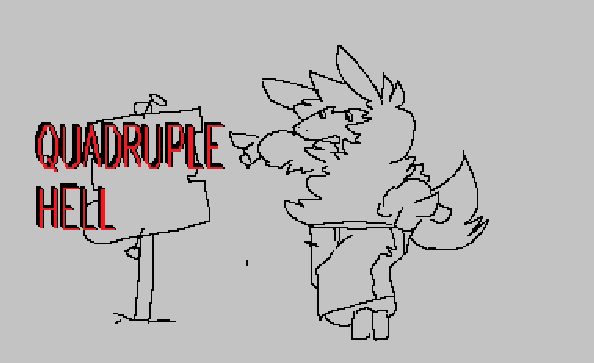
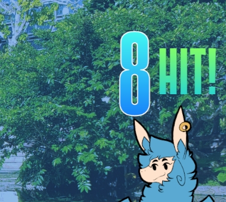
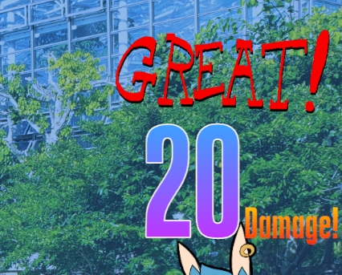
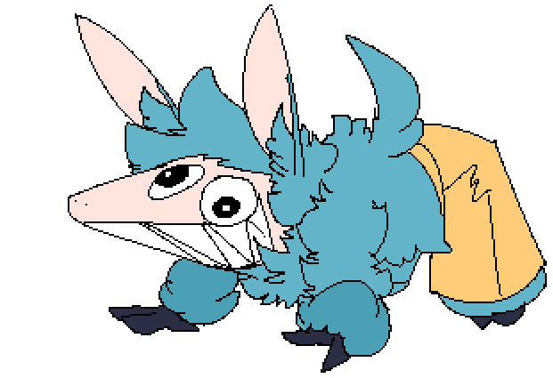
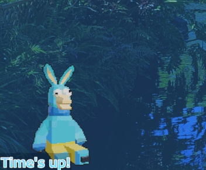

# Welcome to the Iveli Alpaca stream!

I'm Iveli Alpaca, and I'm the one responsible for this mess you're about to subject yourself to.  Thankfully, this manual will help maximize your survival instinct.\
\
Most things here were set up by me with the power of SAMMI, LandiTube, and the Twitch Integrated Throwing System\
\
Official SAMMI site\
https://sammi.solutions/
\
\
Landie's Shop\
https://landie.land/shop/sammi-extensions/
\
\
Twitch Integrated Throwing System\
https://remasuri3.itch.io/tits/

# What the hell?
It can be a bit overwhelming, but this stream has quite a few features to make it an interactive and enjoyable experience.  Think of it like a game you can play as you watch.\
\
***Also please for the love of God***\
***use the Check-In redeem***\
*Twitch keeps changing the rules of the game and I can barely keep up*\
\
Here is a quick glossary of terms\
\
*TITS* - "Twitch Integrated Throwing System", the thing that throws objects at me.\
*SAMMI* - "Stream Automation, Management, Monitoring & Innovation", the software that makes everything here possible.\
*LandiTube* - The thing that makes my avatar bounce around and stuff!  Runs off SAMMI, created by Landie.\
*Lemons* - This channel's version of Channel Points (when life gives you Lemons...)\
*Plenty* - The fake currency used in the pick-pocketing system.  It's called "Plenty" because you want PLENTY of it.  Currently has no use.\
*Dango/Dangonya* - Resident fat French cat, real name Felicity Petit, used for the Text to Speech (TTS), and sometimes appears in the FAT AND SASSY redeem.

# Sounds!!
*Type: Channel Point redeem*\
\
There are many sounds.

# Big fat bouncy Twitch Intergrated Throwing System
*Type: Channel Point redeem*\
\
You can use Lemons.

# The combo counter!
*Type: Channel Point redeem*\
\
As objects hit me in quick succesion, this increases the COMBO counter.\
\

After the combo ends, total damage is tallied up, and the combo will get a random rating.\
\

\
How high can you get it?  Try working together with your fellow viewers!\
*Protip: "Throw Two Objects" can be used to help build and maintain a combo!*\
\
Currently, combos and damage are purely cosmetic.

# Chat commands, as simple as BANG!
*Type: Chat message*\
\
There are quite a few chat commands that anyone can use which cause various effects.\
\
!taunt - Causes me to taunt, which displays a random alpaca for a brief moment.  There is no cost or cooldown, so it can be used over and over.\
\

\
But, if an item hits me shortly after I taunt...\
\

I'll parry it!  This causes the item to do no damage and not count toward the combo counter.  It looks cool though?\
\
!manual or !commands - Brings up a link to the manual.  You're here right now!\
!alpaca - Shares a random alpaca fact.  May or may not be completely accurate (most are accurate though).\
!stoat - Shares a random stoat fact.  What could this imply?\
!lurk - A simple lurk command, doesn't do much else.\
!save - Reminds me to save.  Plays a little animation and sound.\

# Pickpocketing game!
*Type: Channel Point redeem/chat message*\
\
You can use the "Pickpocket Me" redeem to accumulate Plenty.  Once you have some Plenty, you can use the *!pickpocket [username]* command to STEAL Plenty from another chat member!\
*(Currently you need to type the user's name verbatim because I'm dumb and don't know how to properly code*\
\
The !currency command will tell you how much Plenty you have.\

# Russian Roulette?!
*Type: Channel Point redeem*\
\
Once a stream, you can test your luck with this dangerous contraption.  An animation will play, and you will have a 1 in 6 chance of receiving a 30 minute timeout.\

\
*Which is the lucky outcome?  I don't know!*

# Text to Speech, featuring Dangonya
*Type: Channel Point Redeem*\
\
Dangonya will speak whatever Godless nonsense you send to her.\
\

\
She can also read off randomly saved quotes, running off a modified version of chrizzz_1508's Quote System, which can be found here: https://ko-fi.com/s/8c92e53077

# ...doll?

\
*Do not make eye contact with it.*\
*Do not attempt to communicate with it.*\
*Do not listen to anything it says.*\
\
This is the antagonist.  It'll go away if you tell it to SHUT THE F#!% UP.\
*Now with up to only 40% spider eggs*